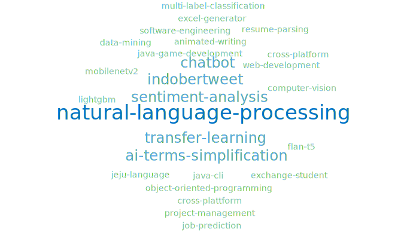

<div align="center">
  
  # Word Cloud Generator for Repository Topics

  A GitHub Action that reads all your repository topics via the GitHub GraphQL API and generates a word cloud SVG.
  
  

  Topics that appear across more repos are displayed larger. Designed to be added to a GitHub profile README.

</div>

---

## How it works

1. A GitHub Action queries the GitHub GraphQL API to get all repository topics
2. Each topic appearance is counted. The more it's used, the bigger its size in the word cloud.
3. A Node.js script places each topic into the world cloud using a spiral algorithm.
4. The resulting SVG is pushed into the repository with the file name `topics.svg`.

---

## Setup

### 1. Create a GitHub token

The action needs a personal access token to query the GraphQL API.

> [!NOTE]
> If you only use this on a public profile repo, you can use the built-in `GITHUB_TOKEN` instead and skip the lengthy steps below. Simply replace `${{ secrets.GH_TOKEN }}` with `${{ secrets.GITHUB_TOKEN }}` in the workflow file.

1. Go to **GitHub → Settings → Developer settings → Personal access tokens → Tokens (classic)**
2. Click **Generate new token (classic)**
3. Give it a name like `wordcloud-repo-topics`
4. Under **Scopes**, check `repo` (needed to read repository topics)
5. Click **Generate token** and don't forget to copy it (tokens can only be viewed once)

Then add it to the repo where the word cloud will be added:

1. Go to the repo's **Settings → Secrets and variables → Actions**
2. Click **New repository secret**
3. Name it something like `GH_TOKEN` and paste the generated token as the value

### 2. Add files to the repo

Copy the workflow and script files into the repo:

```
.github/
  workflows/
    update-topics.yml
scripts/
  update-topics.js
```

### 3. Add the SVG to the README

In the `README.md`, add this line where the word cloud should appear:

```markdown

```

It will embed the generated SVG.

### 4. Run it

Go to the repo's **Actions → Update README topics → Run workflow** to trigger it manually the first time. After that it runs every Sunday at midnight UTC.

---

## Customization

In `scripts/update-topics.js`, adjust these as you like:

### SVG size

```js
const W = 680, H = 400;  // canvas size in pixels
```

### Font size

```js
function fontSize(count) {
  const t = (count - minCount) / (maxCount - minCount);
  return Math.round(14 + t * 6);  // min 14px, max 20px
}
```

### Font colors

Change the colors by editing the `.w1`–`.w4` CSS classes in the SVG `<style>` block inside `makeWordCloud()`. The current palette uses shades of GitHub's topic blue (`#0075ca`).

---

## Credits

**Concept and design**: I decided what to build, how it should look, and iterated from badges → inline SVGs → backtick strings → word cloud.

**Placement algorithm and SVG generation** — built with [Claude](https://claude.ai) (Anthropic). The spiral word placement math, overlap detection, and SVG generation were worked out through conversation.

---

## License

This is a free plugin released into the public domain.

See [unlicense.org](https://unlicense.org) for full details.
